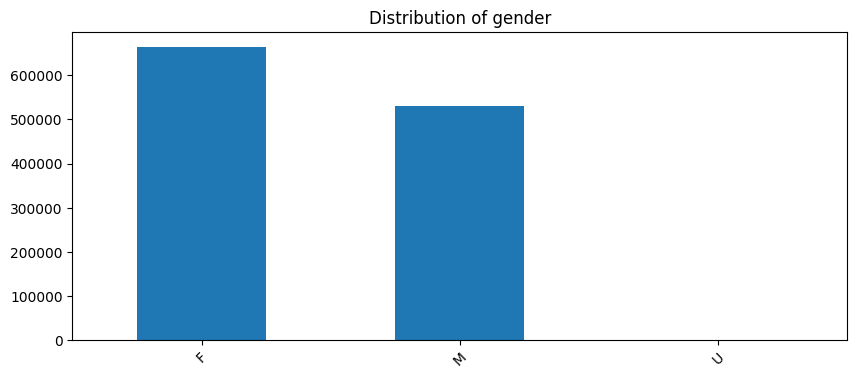

# **Hospitalization Utilization Insights: Diagnoses Driving Costs & Stays.** 

Javier Benitez | April 10, 2025  

---
# Introduction 
**Critical Factors**  
- **Cost**: Most common range between $4k-$17k
- **Length of Stay**: Ranges from 1 to 14 days  
- **Severity**: Moderate/Extreme cases drive cost
- **Diagnoses**: Most common diagnoses by case count

**Dataset**  
- **Source**: [NY Health Data (2012)](https://health.data.ny.gov)  
- **Scope**: 1.2M discharges (NYC-focused)  
- **Size**: 930 MB (34 clinical/demographic fields)

---
# Most patients are 30 years old and older 

---
# Most patients are admitted from the ER and have a mix of illness severity.

---
# Most patients are female 

---
# Most cost centers around $20k

---
# Most common diagnoses

---
# Most common diagnoses and their respective length of stay 

---
# **Most Common Diagnoses Overview**

---
# Key Insights 
**Summary**:
- Dataset: 2012, NYC Focused
- Demographics: female, 30 years and older
- Length of stay: 1-14 days
- Cost range: $4k-$17
- Most common diagnoses: Septicimia, chest pain, alcohol-related conditions, asthma

---
# Next steps
▶ Compare features to state and national benchmarks
▶ Explore conditions for cost savings
▶ Efficient clinical management
▶ Non-clinical factors affecting length of stay
▶ Build real-time dashboard for monitoring